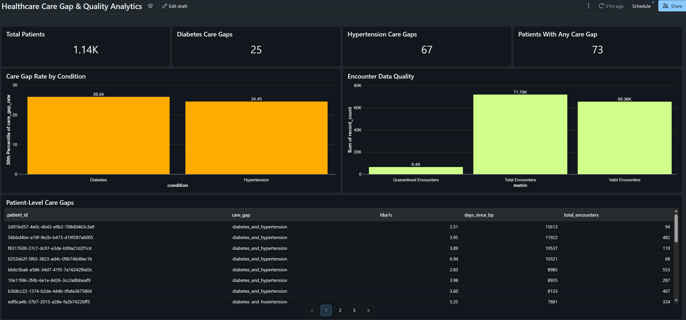

# Healthcare FHIR Modern Data Platform

A modern healthcare data engineering and analytics platform built around
**FHIR R4 synthetic healthcare data**, **Databricks**, **dbt**,
**Snowflake**, **Terraform**, and **GitHub Actions**.

The project demonstrates an end-to-end **Forward Deployed Engineer
(FDE)** approach: translate a healthcare analytics problem into a
reliable data platform, implement data quality controls, expose
business-ready metrics, automate infrastructure validation, and provide
an operational dashboard.

> **Important:** This project uses synthetic Synthea data. It is
> designed with HIPAA-aligned engineering practices, but it is **not a
> HIPAA compliance certification, production PHI system, or claim of
> HIPAA compliance**.

## Business Problem

Healthcare analytics teams need to identify patients who may have gaps
in routine chronic-disease monitoring.

The platform answers questions such as:

-   Which Type 2 diabetes patients have an outdated HbA1c measurement?
-   Which hypertension patients have an outdated blood-pressure
    observation?
-   Which patients have both care gaps?
-   How large are the care-gap populations?
-   How many source records fail validation?
-   Which records were quarantined and require investigation?
-   What patient-level information is available to support operational
    follow-up?

### Intended users

-   Healthcare data analysts
-   Clinical operations teams
-   Population-health analysts
-   Data engineering teams
-   Analytics engineering teams
-   Technical/product stakeholders

## Data Source

Synthetic healthcare data was generated using
[Synthea](https://github.com/synthetichealth/synthea).

Synthea was configured to generate FHIR R4 data, which was then ingested into
Databricks for Bronze, Silver, and Gold processing.

### Data Characteristics

- Source: Synthea synthetic patient generator
- Format: FHIR R4 / NDJSON
- Data type: Synthetic healthcare data
- Real patient PHI: None
- Processing: Databricks / PySpark
- Analytics: dbt + Databricks SQL

## Architecture

``` text
                 Synthea / FHIR R4
                         |
                         v
                Databricks Bronze
              Raw FHIR + metadata
                         |
                         v
                Databricks Silver
       Parsing / normalization / references
                         |
                  Data Quality
                  /          \
               PASS          FAIL
                |              |
                v              v
          Databricks Gold   Quarantine
                |
                v
                dbt
       Staging → Intermediate → Marts
                |
                v
       Databricks SQL Dashboard
                |
                v
        Healthcare Analytics
```

Supporting engineering:

``` text
GitHub
  |
  +-- Git version control
  |
  +-- GitHub Actions
  |      |
  |      +-- Terraform validation
  |      +-- dbt parsing
  |
  +-- Terraform
         |
         +-- Databricks infrastructure/configuration
```

## Technology Stack

  -----------------------------------------------------------------------
  Layer                   Technology              Purpose
  ----------------------- ----------------------- -----------------------
  Source                  Synthea                 Synthetic
                                                  healthcare/FHIR R4 data

  Data Engineering        Databricks              Distributed ingestion
                                                  and transformation

  Storage                 Delta Lake              Bronze/Silver/Gold
                                                  analytical tables

  Analytics Engineering   dbt                     Staging, intermediate
                                                  models, marts, tests

  Warehouse               Snowflake               Enterprise analytics
                                                  target/design

  Infrastructure as Code  Terraform               Databricks
                                                  infrastructure
                                                  configuration

  CI/CD                   GitHub Actions          Automated validation

  BI                      Databricks SQL          Business-facing
                          Dashboard               analytics

  Version Control         Git/GitHub              Source control and
                                                  collaboration

  Language                Python / SQL            Data engineering and
                                                  analytics
  -----------------------------------------------------------------------

## Data Layers

### Bronze

The Bronze layer preserves source FHIR resources in a queryable Delta
format.

Each record includes metadata such as:

-   Raw FHIR JSON
-   Source file
-   Ingestion timestamp
-   Resource type
-   Resource ID

Core resources include Patient, Encounter, Condition, Observation,
DiagnosticReport, MedicationRequest, MedicationAdministration,
Procedure, CarePlan, CareTeam, AllergyIntolerance, Immunization, and
Device.

### Silver

The Silver layer converts nested FHIR resources into standardized
analytical structures.

Implemented Silver models:

-   `silver_patient`
-   `silver_condition`
-   `silver_observation`
-   `silver_encounter`

The layer handles FHIR reference parsing, standardized fields, date
normalization, analytical code extraction, data-quality validation, and
invalid-record quarantine.

### Gold

Gold models contain business-oriented healthcare analytics:

-   `gold_diabetes_care_gap`
-   `gold_hypertension_care_gap`
-   `gold_healthcare_quality_metrics`
-   `gold_patient_360`

## Data Quality and Quarantine

The project intentionally demonstrates failure handling rather than
assuming all source data is valid.

``` text
FHIR Record
    |
    v
Validation
    |
    +---- PASS ----> Silver / Gold
    |
    +---- FAIL ----> Quarantine
```

The encounter pipeline identifies records without a valid patient
reference and places them into a quarantine table for investigation.

Current synthetic-data results:

  Metric                     Result
  ------------------------ --------
  Total encounters           71,751
  Valid encounters           65,355
  Quarantined encounters      6,396
  Quarantine rate            \~8.9%

## Healthcare Analytics Results

Current synthetic dataset results:

  Metric                         Result
  ---------------------------- --------
  Total patients                  1,141
  Type 2 diabetes patients           96
  Diabetes HbA1c care gaps           25
  Diabetes care-gap rate         26.04%
  Hypertension patients             274
  Hypertension BP care gaps          67
  Hypertension care-gap rate     24.45%
  Patients with any care gap         73

The Type 2 diabetes cohort uses the exact primary Type 2 diabetes code
used by the synthetic dataset rather than broadly counting
diabetes-related complications.

## dbt

dbt provides the analytics-engineering layer above the Databricks Gold
data.

### Staging

-   `stg_patient_360`
-   `stg_diabetes_care_gap`
-   `stg_hypertension_care_gap`

### Intermediate

-   `int_patient_care_gaps`

This model combines patient, diabetes, hypertension, and encounter
information and derives the `care_gap_type` business classification.

### Marts

-   `mart_healthcare_quality`
-   `mart_patient_care_gaps`

### Validation

Latest full dbt build:

``` text
6 models
12 data tests
18 total resources

PASS=18
WARN=0
ERROR=0
SKIP=0
```

## Databricks SQL Dashboard

The implemented dashboard is:

**Healthcare Care Gap & Quality Analytics**

It contains:

-   Executive KPI cards
-   Diabetes and hypertension care-gap rates
-   Encounter data-quality metrics
-   Patient-level care-gap records

The dashboard connects business metrics to operational action and
data-quality visibility.



## Terraform

Terraform is used for Infrastructure as Code rather than for
transforming healthcare data.

The current Databricks Terraform configuration:

-   Configures the Databricks provider
-   Reads the workspace catalog
-   Creates the `healthcare_analytics` schema
-   Supports repeatable infrastructure deployment
-   Enables infrastructure changes to be reviewed through Git

Validation performed:

``` text
terraform fmt -check -recursive
terraform init -backend=false
terraform validate
terraform plan
```

The plan reached:

``` text
No changes. Your infrastructure matches the configuration.
```

## CI/CD

GitHub Actions validates the repository on pushes and pull requests.

Current checks include:

-   Terraform formatting
-   Terraform initialization
-   Terraform validation
-   dbt installation
-   dbt CI profile creation
-   dbt parsing

No Databricks credentials are stored in the repository.

## Security Design

The project follows a **HIPAA-aligned engineering approach** for
demonstration purposes.

Security principles include:

-   Synthetic data only
-   Data minimization
-   Least-privilege access
-   Layered data architecture
-   Separation of raw and analytical data
-   Quarantine of invalid records
-   Infrastructure as Code
-   Version-controlled changes
-   No credentials committed to Git
-   Auditability through platform and CI/CD history
-   Encryption expected for production deployments

A synthetic SSN-like identifier exists in the source FHIR Patient
resource. It is intentionally **not propagated into the Silver or Gold
analytical models**.

For a real PHI deployment, additional organizational, administrative,
physical, technical, contractual, and regulatory controls would be
required.

See `docs/security/hipaa-aligned-security.md`.

## Snowflake

Snowflake was provisioned as an enterprise analytics target/design layer
with:

-   `HEALTHCARE_WH`
-   `HEALTHCARE_ANALYTICS`
-   `HEALTHCARE_ANALYTICS.GOLD`

A Databricks-to-Snowflake Delta Sharing integration was investigated,
but the Snowflake Trial environment returned `DS_GATEKEEPER_DISABLED`
for the required sharing feature. Therefore, the project does **not**
claim a completed production-style Snowflake data share.

## BI / Omni Decision

Omni was evaluated as a potential BI layer but was not implemented
because the required signup/access path was not available in the current
environment.

The implemented presentation layer is **Databricks SQL Dashboard**. Omni
or Power BI could be added later as downstream BI consumers.

## Repository Structure

``` text
healthcare-fhir-modern-data-platform/
├── .github/workflows/ci.yml
├── databricks/
│   ├── bronze/
│   ├── silver/
│   ├── gold/
│   ├── quality/
│   └── notebooks/
├── dbt/
│   ├── models/
│   │   ├── staging/
│   │   ├── intermediate/
│   │   └── marts/
│   ├── tests/
│   ├── macros/
│   └── seeds/
├── snowflake/
│   ├── sql/
│   ├── roles/
│   └── policies/
├── terraform/
│   ├── environments/
│   │   ├── dev/
│   │   └── prod/
│   └── modules/
├── docs/
│   ├── architecture/
│   ├── adr/
│   ├── security/
│   ├── data-quality/
│   └── runbooks/
├── tests/
├── .gitignore
└── dbt_project.yml
```

## FDE Engineering Approach

``` text
1. Understand the business problem
           ↓
2. Define analytical requirements
           ↓
3. Identify source and data constraints
           ↓
4. Design the architecture
           ↓
5. Build ingestion and transformations
           ↓
6. Implement data-quality controls
           ↓
7. Handle failure and quarantine paths
           ↓
8. Build business-facing analytics
           ↓
9. Automate infrastructure validation
           ↓
10. Document tradeoffs and limitations
```

Important tradeoffs are documented rather than hidden: Databricks
handles distributed FHIR processing, dbt handles analytics/business
transformations, Terraform manages infrastructure, Databricks SQL
provides the implemented BI layer, and Snowflake/Omni limitations are
explicitly documented.

## Reproducing the Project

Generate synthetic FHIR data with Synthea, upload the required FHIR
resources to Databricks, and run the Bronze, Silver, Quality, and Gold
pipelines.

From the `dbt` directory:

``` powershell
dbt debug
dbt build
```

For Terraform:

``` powershell
cd terraform/environments/dev
terraform init
terraform fmt -check -recursive
terraform validate
terraform plan
```

## Limitations

This is a portfolio implementation using synthetic healthcare data. It
is not:

-   A production clinical system
-   A HIPAA compliance certification
-   A production PHI environment
-   A real EHR integration
-   A completed Snowflake Delta Sharing deployment
-   An implemented Omni integration

## Future Enhancements

-   Incremental/streaming FHIR ingestion
-   Automated schema evolution
-   Additional FHIR resources
-   More chronic conditions
-   Provider/location analytics
-   Automated anomaly detection
-   Data-quality alerting
-   Production secrets management
-   CI/CD deployment to Databricks
-   Production Snowflake integration
-   Power BI or Omni integration
-   Automated lineage and documentation
-   Terraform-managed access policies

## License

This project is licensed under the [MIT License](LICENSE).